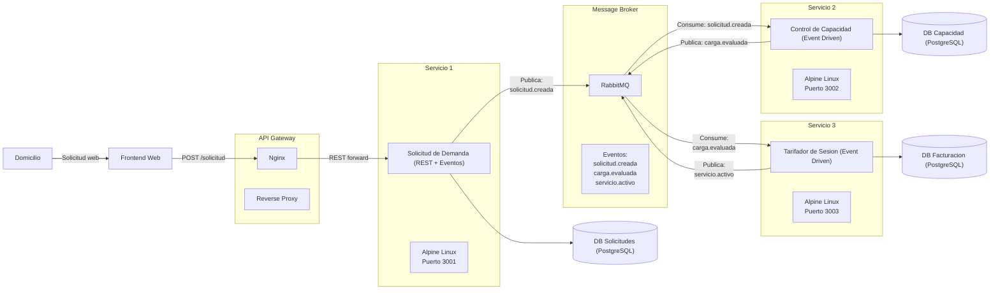

# Smart Grid — Gestor de Red Eléctrica Inteligente

> Sistema de microservicios asincrónicos para la gestión de demanda eléctrica residencial en tiempo real.
> Desplegado en Kubernetes/K3s con CI/CD automatizado mediante GitHub Actions.


---

## Tabla de Contenidos

1. [Diagrama Arquitectura](#1-diagrama-arquitectura)
2. [Contrato de Datos](#2-contrato-de-datos)
3. [Guía de Configuración de Acceso](#3-guía-de-configuración-de-acceso)
4. [Manual Operativo de Control](#4-manual-operativo-de-control)
5. [Roles del Equipo](#5-roles-del-equipo)

---

## 1. Diagrama Arquitectura

El siguiente diagrama representa el flujo completo de un mensaje desde que el domicilio realiza una solicitud hasta que el servicio queda activo y registrado para facturación.



## 2. Contrato de Datos

Especificación exacta de los mensajes JSON que viajan por cada cola de RabbitMQ.

---

### Cola `solicitud.creada`
**Publicado por:** Servicio 1  
**Consumido por:** Servicio 2  
**Disparador:** Un domicilio solicita consumo de alta potencia por REST

```json
{
  "id_solicitud":            "REQ-2026-001",
  "id_domicilio":            1045,
  "potencia_solicitada_kw":  22.5,
  "timestamp":               "2026-06-17T12:30:00Z"
}
```

| Campo | Tipo | Descripción |
|-------|------|-------------|
| `id_solicitud` | `string` | Identificador único de la solicitud. Formato: `REQ-YYYY-NNN` |
| `id_domicilio` | `integer` | ID del domicilio que solicita energía |
| `potencia_solicitada_kw` | `float` | Potencia requerida en kilowatts |
| `timestamp` | `string (ISO 8601)` | Fecha y hora exacta de la solicitud |

---

### Cola `carga.aprobada`
**Publicado por:** Servicio 2  
**Consumido por:** Servicio 3  
**Disparador:** El Servicio 2 termina de evaluar la capacidad del transformador

```json
{
  "id_solicitud":           "REQ-2026-001",
  "id_domicilio":           1045,
  "potencia_solicitada_kw": 22.5,
  "aprobado":               true,
  "motivo_rechazo":         null,
  "timestamp_evaluacion":   "2026-06-17T12:30:02Z"
}
```

| Campo | Tipo | Descripción |
|-------|------|-------------|
| `id_solicitud` | `string` | Referencia a la solicitud original |
| `id_domicilio` | `integer` | ID del domicilio evaluado |
| `potencia_solicitada_kw` | `float` | Potencia que se evaluó |
| `aprobado` | `boolean` | `true` si hay capacidad disponible, `false` si la red está saturada |
| `motivo_rechazo` | `string \| null` | Descripción del rechazo si `aprobado = false`, de lo contrario `null` |
| `timestamp_evaluacion` | `string (ISO 8601)` | Momento en que el Servicio 2 completó la evaluación |

---

### Cola `servicio.activo`
**Publicado por:** Servicio 3  
**Consumido por:** Frontend (actualización en tiempo real)  
**Disparador:** El Servicio 3 registra el inicio del consumo y calcula la tarifa

```json
{
  "id_solicitud":     "REQ-2026-001",
  "id_domicilio":     1045,
  "tarifa_por_kw_clp": 150,
  "estado_servicio":  "activo",
  "timestamp_inicio": "2026-06-17T12:30:05Z"
}
```

| Campo | Tipo | Descripción |
|-------|------|-------------|
| `id_solicitud` | `string` | Referencia a la solicitud que originó el servicio |
| `id_domicilio` | `integer` | ID del domicilio con servicio activo |
| `tarifa_por_kw_clp` | `integer` | Tarifa calculada en pesos chilenos por kilowatt |
| `estado_servicio` | `string` | Estado final: `"activo"` o `"rechazado"` |
| `timestamp_inicio` | `string (ISO 8601)` | Momento exacto de inicio del consumo para facturación |

---

## 3. Guía de Configuración de Acceso

## 4. Manual Operativo de Control

## 5. Roles del Equipo

| Rol | Integrante | Responsabilidad | Stack técnico |
|-----|-----------|----------------|---------------|
| **Rol 1 — DevOps e Infraestructura** | Fabián Flores | Clúster K3s, namespaces, Ingress, CronJobs, GitHub Actions CI/CD | Kubernetes, K3s, Traefik, GitHub Actions, YAML |
| **Rol 2 — Datos y Mensajería** | Jorge Cáceres | RabbitMQ, bases de datos, PersistentVolumes, contratos JSON | RabbitMQ, PostgreSQL 15-alpine, JSON |
| **Rol 3 — Core Backend** | Bryan Vidaurre | Tres microservicios con lógica de negocio e imágenes Docker optimizadas | Python, Flask/FastAPI, Gunicorn, Pika, Alpine Linux |
| **Rol 4 — Frontend y API Gateway** | Gustavo Morales | Interfaz de usuario, proxy reverso, actualización en tiempo real | HTML, CSS, JavaScript nativo, Nginx |

---

## 6. Estado de Avance

| Semana | Período | Objetivo | Estado |
|--------|---------|----------|--------|
| **Semana 1** | Jun 15 – 19 | Planificación de contratos y acuerdos de grupo | ✅ Completado |
| **Semana 2** | Jun 22 – 26 | Construcción de servicios Alpine + Hito 1 (Formato Cliente) | 🔄 En progreso |
| **Semana 3** | Jun 29 – Jul 03 | Integración K3s + conexión RabbitMQ en clúster | ⏳ Pendiente |
| **Semana 4** | Jul 06 – 10 | CI/CD completo + Hito 2 (Formato Técnico) | ⏳ Pendiente |
| **Semana 5** | Jul 13 – 17 | Alta disponibilidad, backups, Defensa Final (Jul 17) | ⏳ Pendiente |


*Proyecto Final — Taller de Integración / Infraestructura — Universidad de Tarapacá — Julio 2026*


