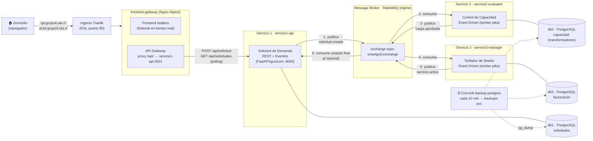

# Smart Grid — Gestor de Red Eléctrica Inteligente

> Sistema de microservicios asincrónicos para la gestión de demanda eléctrica residencial en tiempo real.
> Desplegado en Kubernetes/K3s con CI/CD automatizado mediante GitHub Actions.


---

## Tabla de Contenidos

1. [Diagrama Arquitectura](#1-diagrama-arquitectura)
2. [Contrato de Datos](#2-contrato-de-datos)
3. [Guía de Configuración de Acceso](#3-guía-de-configuración-de-acceso)
4. [Manual Operativo de Control](#4-manual-operativo-de-control)
5. [CI/CD y Modelo de Ramas](#5-cicd-y-modelo-de-ramas)
6. [Roles del Equipo](#6-roles-del-equipo)
7. [Estructura del Repositorio](#7-estructura-del-repositorio)
8. [Ejecución Local (docker compose)](#8-ejecución-local-docker-compose)
9. [Estado de Avance](#9-estado-de-avance)

---

## 1. Diagrama Arquitectónico

Camino completo de un mensaje: el domicilio crea la solicitud por REST, los tres
servicios lógicos se coordinan **solo por eventos** a través del broker, y el
estado final vuelve al historial del frontend (que consulta el avance en tiempo
real). Cada servicio tiene su **base de datos propia y aislada** (prohibido
consultar la BD de otro componente).



Notas de diseño:

- **Dos ecosistemas completos e idénticos** conviven en el clúster compartido: namespace `grupo4-qa` (dominio `qa.grupo4.uta.cl`, imágenes `:qa`) y `grupo4-prod` (`prod.grupo4.uta.cl`, imágenes `:prod`), con `ResourceQuota` y `LimitRange` para no afectar a otros grupos.
- Los Servicios 2 y 3 **no exponen puertos**: son consumidores puros; nadie puede saltarse la cola.
- Todas las imágenes de aplicación son **Alpine** construidas en dos etapas (builder + runner).
- La capacidad se **descuenta de verdad** en db2 al aprobar una carga (una sentencia `UPDATE ... WHERE capacidad_restante_kw >= potencia` atómica); el mapeo domicilio→transformador del sector es `id = (id_domicilio % 3) + 1` sobre los 3 transformadores sembrados.

## 2. Contrato de Datos

Los tres eventos viajan por el exchange **`smartgrid.exchange`** (tipo `topic`).
Cada cola está ligada con una routing key del mismo nombre. Cada servicio
declara exchange/colas/bindings de forma **idempotente** al conectarse, por lo
que el sistema se auto-configura incluso con un RabbitMQ recién nacido
(`messaging/definitions.json` documenta la topología).

### Cola `solicitud.creada`
**Publica:** Servicio 1 · **Consume:** Servicio 2 · **Disparador:** un domicilio pide alta potencia por REST

```json
{
  "id_solicitud":            "REQ-2026-001",
  "id_domicilio":            1045,
  "potencia_solicitada_kw":  22.5,
  "timestamp":               "2026-07-07T12:30:00Z"
}
```

| Campo | Tipo | Descripción |
|-------|------|-------------|
| `id_solicitud` | `string` | Único, generado con la SEQUENCE de db1. Formato `REQ-YYYY-NNN` |
| `id_domicilio` | `integer` | ID del domicilio que solicita energía |
| `potencia_solicitada_kw` | `float` | Potencia requerida en kilowatts |
| `timestamp` | `string (ISO 8601)` | Fecha y hora exacta de la solicitud |

### Cola `carga.aprobada`
**Publica:** Servicio 2 · **Consume:** Servicio 3 · **Disparador:** evaluación (y descuento) de capacidad en db2

```json
{
  "id_solicitud":           "REQ-2026-001",
  "id_domicilio":           1045,
  "potencia_solicitada_kw": 22.5,
  "aprobado":               true,
  "motivo_rechazo":         null,
  "timestamp_evaluacion":   "2026-07-07T12:30:02Z"
}
```

| Campo | Tipo | Descripción |
|-------|------|-------------|
| `id_solicitud` | `string` | Referencia a la solicitud original |
| `id_domicilio` | `integer` | ID del domicilio evaluado |
| `potencia_solicitada_kw` | `float` | Potencia que se evaluó |
| `aprobado` | `boolean` | `true` si el transformador del sector tenía margen (se descontó la capacidad) |
| `motivo_rechazo` | `string \| null` | Motivo si `aprobado = false`; de lo contrario `null` |
| `timestamp_evaluacion` | `string (ISO 8601)` | Momento en que el Servicio 2 completó la evaluación |

### Cola `servicio.activo`
**Publica:** Servicio 3 · **Consume:** Servicio 1 (actualiza el estado en db1; el frontend lo ve por polling) · **Disparador:** registro de facturación en db3

```json
{
  "id_solicitud":      "REQ-2026-001",
  "id_domicilio":      1045,
  "tarifa_por_kw_clp": 150,
  "estado_servicio":   "activo",
  "timestamp_inicio":  "2026-07-07T12:30:05Z"
}
```

| Campo | Tipo | Descripción |
|-------|------|-------------|
| `id_solicitud` | `string` | Referencia a la solicitud que originó el servicio |
| `id_domicilio` | `integer` | ID del domicilio con servicio activo |
| `tarifa_por_kw_clp` | `integer` | Tarifa en CLP/kW (`150` si activo, `0` si rechazado) |
| `estado_servicio` | `string` | `"activo"` o `"rechazado"` |
| `timestamp_inicio` | `string (ISO 8601)` | Inicio del consumo para la facturación mensual |

### API REST expuesta (vía gateway `/api/`)

| Método y ruta | Uso |
|---------------|-----|
| `POST /api/solicitud` | Crea la solicitud (queda **"En evaluación"** en db1 y se publica `solicitud.creada`) |
| `GET /api/solicitudes?limit=20` | Historial con estado actualizado (el frontend lo consulta cada 3 s) |
| `GET /api/healthz` | Salud del Servicio 1 (`db` y `rabbitmq` true/false) |
| `GET /health` | Salud del frontend-gateway (responde el propio Nginx) |

## 3. Guía de Configuración de Acceso
El sistema NO se accede por `IP:puerto`, sino por **nombre de dominio** a través del Ingress.

## 3.1 Acceso al clúster con `kubectl`

```bash
# En la VM (una vez): copiar el kubeconfig de K3s
sudo cat /etc/rancher/k3s/k3s.yaml
# Pegarlo en tu PC como ~/.kube/config-grupo4 y cambiar:
#   server: https://127.0.0.1:6443  ->  https://146.83.102.23:6443
export KUBECONFIG=~/.kube/config-grupo4       # Linux/macOS
# En Windows PowerShell:  $env:KUBECONFIG="$HOME\.kube\config-grupo4"
kubectl get nodes
```

### 3.2 Acceso al sistema por dominio

El tráfico entra por el Ingress de Traefik, que enruta según el header `Host`. Como el dominio `qa.grupo4.uta.cl` no tiene registro DNS público, se resuelve con una línea en el archivo `hosts` del equipo que abre el navegador:

| Sistema | Archivo `hosts` | Línea a agregar |
|---|---|---|
| Windows | `C:\Windows\System32\drivers\etc\hosts` | `146.83.102.23   qa.grupo4.uta.cl` |
| Linux/macOS | `/etc/hosts` | `146.83.102.23   qa.grupo4.uta.cl` |

> En Windows hay que editar el archivo **como administrador**. La forma más simple es PowerShell (como admin):
> ```powershell
> Add-Content -Path "C:\Windows\System32\drivers\etc\hosts" -Value "146.83.102.23`tqa.grupo4.uta.cl"
> ```

Comprobar el acceso:

```bash
curl http://qa.grupo4.uta.cl/health          # -> "frontend-gateway ok"
curl http://qa.grupo4.uta.cl/api/healthz      # -> {"status":"ok","db":true,"rabbitmq":true}
# Prueba sin tocar /etc/hosts (pasando el Host a mano):
curl -H "Host: qa.grupo4.uta.cl" http://146.83.102.23/health
```

Una vez resuelto el nombre, abrir `http://qa.grupo4.uta.cl` en el navegador muestra el frontend. (PROD será idéntico con `prod.grupo4.uta.cl` → nodo de producción.)

---

## 4. Manual Operativo de Control
Todos los comandos asumen `kubectl` configurado (§3.1) o `sudo k3s kubectl` desde la VM. Reemplazar `grupo4-qa` por `grupo4-prod` según el entorno.

### 4.1 Estado general

```bash
kubectl -n grupo4-qa get pods -o wide          # todos los Pods, con IP y nodo
kubectl -n grupo4-qa get svc,ingress,cronjob   # servicios, ingress y respaldos
kubectl -n grupo4-qa describe resourcequota    # consumo vs. tope del namespace
```

Todo sano = 8 Deployments en `Running 1/1` (db1, db2, db3, rabbitmq, service1-api, service2-evaluator, service3-manager, frontend-gateway) + el Job `rabbitmq-topology` en `Completed`.

## 5. CI/CD y Modelo de Ramas

**Cero despliegues manuales**: nadie entra por consola al servidor para
desplegar. GitHub Actions construye las imágenes Alpine, las publica en GHCR
(registro público) y aplica los manifiestos en el clúster.

| Rama | Evento | Workflow | Destino |
|------|--------|----------|---------|
| `dev-<nombre>` (4 ramas personales) | push | — | — |
| PR → `develop` / `main` | pull_request | `ci.yml` (check **`validar-pr`**: lint YAML/JSON/Python + build sin push) | — |
| `develop` | push (merge del PR) | `deploy-qa.yml` | namespace `grupo4-qa` → `qa.grupo4.uta.cl` |
| `main` | push (merge del PR) | `deploy-prod.yml` | namespace `grupo4-prod` → `prod.grupo4.uta.cl` |

`main` y `develop` están protegidas por un Branch Ruleset: solo se entra por
**PR aprobado + check `validar-pr` en verde**. 

## 6. Roles del Equipo

| Rol | Integrante | Responsabilidad | Stack técnico |
|-----|-----------|----------------|---------------|
| **Rol 1 — DevOps e Infraestructura** | Fabián Flores | Clúster K3s, namespaces, Ingress, CronJobs de respaldo, GitHub Actions CI/CD | Kubernetes, K3s, Traefik, GitHub Actions, YAML |
| **Rol 2 — Datos y Mensajería** | Jorge Cáceres | RabbitMQ, bases de datos, PersistentVolumes, contratos JSON | RabbitMQ, PostgreSQL 15-alpine, JSON |
| **Rol 3 — Core Backend** | Bryan Vidaurre | Tres microservicios con lógica de negocio e imágenes Docker optimizadas | Python, FastAPI, Gunicorn, Pika, Alpine Linux |
| **Rol 4 — Frontend y API Gateway** | Gustavo Morales | Interfaz de usuario, proxy reverso, actualización en tiempo real | HTML, CSS, JavaScript nativo, Nginx |

## 7. Estructura del Repositorio

```text
├── .github/workflows/     ci.yml (PRs) · deploy-qa.yml (develop) · deploy-prod.yml (main)
├── frontend-gateway/      Nginx Alpine: frontend + proxy /api (una sola imagen)
├── service1-api/          Servicio 1 · FastAPI :8000 (REST + eventos)
├── service2-evaluator/    Servicio 2 · worker pika (capacidad, db2)
├── service3-manager/      Servicio 3 · worker pika (facturación, db3)
├── database/              init-*.sql (esquemas + seeds; fuente de verdad)
├── messaging/             definitions.json (topología del broker, referencia)
├── k8s/
│   ├── namespaces.yaml    grupo4-qa y grupo4-prod + LimitRange + ResourceQuota
│   ├── qa/                ecosistema QA completo (01…11, incluye backups)
│   ├── prod/              espejo PROD (dominio/tag/claves propios)
│   └── restore/           Job de restauración desde backups-pvc
├── docker-compose.yml     espejo local del clúster para desarrollo
└── docs/                  guías del Rol 1 (CI/CD, operación, correcciones)
```

## 8. Estado de Avance

| Semana | Período | Objetivo | Estado |
|--------|---------|----------|--------|
| **Semana 1** | Jun 15 – 19 | Planificación de contratos y acuerdos de grupo | ✅ Completado |
| **Semana 2** | Jun 22 – 26 | Servicios Alpine + Hito 1 (Formato Cliente) | ✅ Completado |
| **Semana 3** | Jun 29 – Jul 03 | Integración K3s + conexión RabbitMQ en clúster | ✅ Completado |
| **Semana 4** | Jul 06 – 10 | CI/CD completo + Hito 2 (Formato Técnico) | ✅ Completado |
| **Semana 5** | Jul 13 – 17 | Dominios, backups cada 10 min, logs unificados, Defensa Final (Jul 17) | 🔄 Listo para defensa |

---

*Proyecto Final — Taller de Integración / Infraestructura — Universidad de Tarapacá — Julio 2026*
